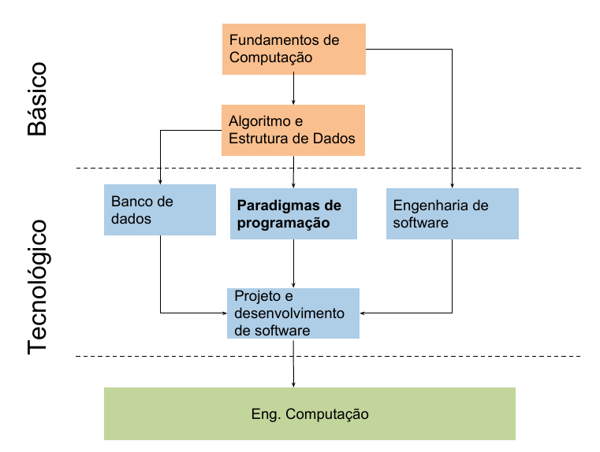

## Apresentação da disciplina

* Relação com outras disciplinas
* Algumas perguntas
* Ementa da disciplina
* Conteúdo programático
* Avaliações
* Referências
* Veja mais referências

***

## Comparando Python e C

Dado que espera-se que todos aqui saibam Python e C, podemos começar apontando características e conceitos de ambas linguagens. Não vamos aqui preocupar com os termos usados na literatura, porém caso conheçam podemos usar.

C:

 * baixo nivel
 * médio nível
 * estruturada
 * procedural
 * estaticamente tipada
 * compilada 
 * imperativo

Python:

* alto nivel
* dinamicamente tipada
* orientada a objeto
* identação faz parta da sintaxe
* interpretada
* imperativo
* funcional
 

***

### Algumas perguntas 

Ao estudar uma linguagem programação, pode surgir as seguintes dúvidas:

* Por que devo evitar variáveis globais ? 
* Por que eu não declaro variáveis em Python 
* A linguagem Python é fracamente tipada ? 
* O que é sobrecarga em linguagens de programação? 
* A linguagem C possui passagem por referência ou só por valor?
* O que é avaliação preguiçosa? 
* É verdade que existem linguagens que podem operar sobre listas infinitas? 
* Existem linguagens que não possuem estruturas de iteração (for, while) ? 
* O que são valores de primeira classe?
* O que são funções de alta ordem?
* O que é polimorfismo?
  
> espero que no fim da disciplina, vocês consigam responder e discutir sobre essas e outras perguntas.
> 
***
### Relação com outras disciplinas

### Ementa da disciplina

* Principais **paradigmas** de **linguagens de programação**. 
* Estudo comparativo dos paradigmas. 
* Integração de paradigmas. 
* Estudo detalhado de uma linguagem de programação baseada em um dos paradigmas apresentados.

### Metodologia

* **Foco**: Orientação a objetos, dado ser o paradigma dominante.
* **Linguagem**: Java, dado que é provavelmente a linguagem orientada a objeto mais utilizada para uso geral. Além disso, ela faz parte da família de linguagens que definiram a programação orientada a objetos. Elá é baseada em classes, estaticamente tipada, não é uma linguagem de script, e não buscava ser uma linguagem híbrida.

> Essas características de Java não leva a dizer que ela é melhor ou pior, apenas que acreditamos ser uma boa linguagem para estudar programação orientada a objetos.

***
#### Avaliações

* Unidade 1
  * Prova Escrita - 6 pts
  * Seminário sobre os padrões de projeto - 4 pts
* Unidade 2
  * Laboratórios - 5 pts
  * Seminário sobre linguagens, frameworks, bibliotecas ou sdks - 5 pts
* Unidade 3
  * Laboratórios - 3 pts
  * Projeto final - 7 pts

***

### Referências

#### Básicas

1. Sebesta, Robert W.,  Conceitos de Linguagens de Programação. 9º edição, Bookman, 2011.
2. Deitel, H. M. & Deitel, P. J. Java Como Programar. 8º edição. Pearson, 2010.
3. Bjarne Stroustrup. Princípios e Práticas de Programação Com C++, Bookman. 2012.
4. David A. Watt. Programming Language Design Concepts. Wiley, 2006
5. Kawano, Wilson. Migrando De C Para C++. 1º Edição, Ciência Moderna. 2010.

#### Complementares

1. Varejão, F. M. Linguagens de Programação: Conceitos e Técnicas. 2004.
2. Allen Tucker; Robert Noonan, Linguagens de Programação Princípios e Paradigmas, 2ª Edição, McGraw-Hill, 2009.
3. Claudio Cesar de Sá e Marcio Ferreira da Silva. Haskell – Uma abordagem prática, Novatec, 2006. 
   
#### Veja mais referências

##### Cursos conceitos de linguagens de programação

* [ Coursera - Programming Languages, Part A](https://www.coursera.org/learn/programming-languages/home/welcome)
* [ Coursera - Programming Languages, Part B](https://www.coursera.org/learn/programming-languages-part-b)
* [ Coursera - Programming Languages, Part C](https://www.coursera.org/learn/programming-languages-part-c/home/welcome)

##### Livros sobre Java

* [**David Flanagan - Java in a Nutshell 6th Edition**](http://www.r-5.org/files/books/computers/languages/java/main/Benjamin_Evans_David_Flanagan-Java_in_a_Nutshell_6th_ed-EN.pdf), eu gosto muito desse livro, e bom para começar. A sexta edição está atualizada para o Java 8.
* [**Paulo Silveira - Java 8 Pratico Lambdas Streams e os Novos Recursos da Linguagem**](https://www.casadocodigo.com.br/products/livro-java8), um bom livro em português para conhecer os recursos da versão 8.0. 
* [Goal Kicker - Java Notes For Professionals](https://goalkicker.com/JavaBook/JavaNotesForProfessionals.pdf), um livro bem direto com foco na linguagem. Não é um bom livro para quem não tem conhecimento de orientação a objetos.
* Head First - Java Second Edition, um pouco antigo, mas gosto muito dessa série para começar a conhecer uma linguagem e ou tecnologia.
* Deitel - Java How To Program Ninth Edition, o livro mais conhecido e citado.
* Gonzalez - Mastering Concurrency Programming with Java 8, um pouco mais avançado, mas importante para utilizar melhor os recursos de programação concorrente.

##### Cursos sobre Java

* [ Udacity - Intro to Java Programming](https://classroom.udacity.com/courses/cs046)
* [ EdX - Introduction to Java Programming](https://www.edx.org/professional-certificate/uc3mx-introduction-java-programming)
* [ Udacity - Object Oriented Programming with Java](https://classroom.udacity.com/courses/ud283)
* [ EdX - Object Oriented Programming in Java](https://courses.edx.org/courses/course-v1:Microsoft+DEV277x+1T2018/course/)
* [ Coursera - Orientação a Objetos com Java](https://www.coursera.org/learn/orientacao-a-objetos-com-java/home/welcome), curo em Português, ministrado por professor do ITA e do INPE
* [ Udemy - Master Object Oriented Design in Java - Homework + Solutions](https://www.udemy.com/mastering-object-oriented-design-in-java/learn/v4/overview)

