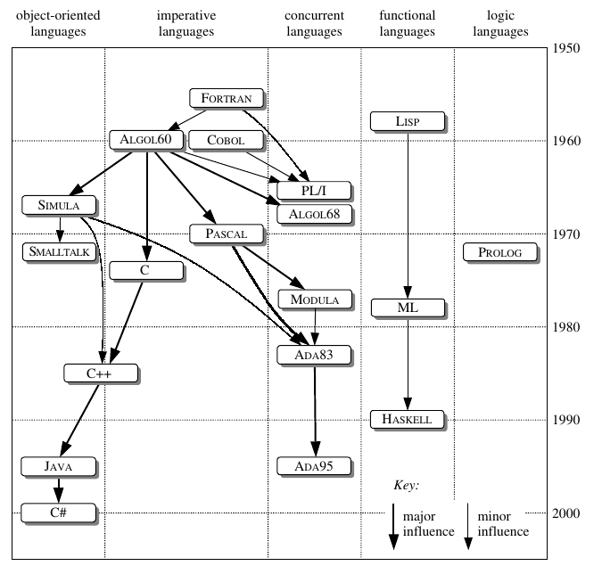
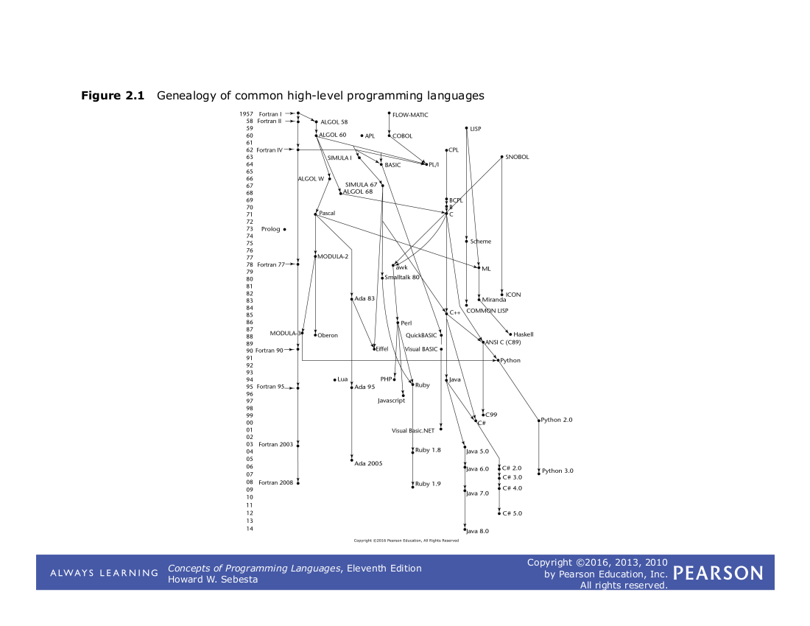

## Evolução e breve visão dos paradigmas de programação

* As primeiras linguagens de máquina
* As primeiras linguagens de alto nível
* Paradigma Estruturado 
* Paradigma Orientada a objetos
* Paradigma funcional
* Paradigma lógico
* Timeline


### As primeiras linguagens de máquina

* Com o surgimento do conceito de programa armazenado, estes passaram a ser programáveis através de uma sequencia de instruções. 
* Inicialmente, estas instruções eram escritas em uma linguagem de máquina especifica para cada computador. 
* O principal problema com estas linguagens, denominada de primeira geração,  erra a falta de portabilidade.

```
    ; adds up the values n+...+3+2+1(+0) in a loop and stores
    ; the sum in memory at the location labeled "sum"
	
    loop:   S(x)->Ac+  n    ;load n into AC
            Cc->S(x)   pos  ;if AC >= 0, jump to pos
            halt            ;otherwise done
            .empty          ;a 20-bit 0
    pos:    S(x)->Ah+  sum  ;add n to the sum
            At->S(x)   sum  ;put total back at sum
            S(x)->Ac+  n    ;load n into AC
            S(x)->Ah-  one  ;decrement n
            At->S(x)   n    ;store decremented n
            Cu->S(x)   loop ;go back and do it again   

    n:     .data 5  ;will loop 6 times total
    one:   .data 1  ;constant for decrementing n
    sum:   .data 0  ;where the running/final total is kept

```

http://www.cs.colby.edu/djskrien/IASSim/


### As primeiras linguagens de alto nível

* Com essas linguagens melhorou a portabilidade dos programas. Porém, o controle de fluxo ainda era similar aos das linguagens de primeira geração, fazendo muito uso de saltos condicionais e incondicionais (“gotos”).  
* Estes desvios transferem o controle de execução para um lugar especifico no programa. Este mecanismo é muito flexível e suficiente para desenvolver qualquer sistema. 
  * Porém, esses saltos levam a códigos onde  o fluxo de execução não segue o fluxo usual de leitura,  que é de cima para baixo. 
  * Isso dificulta a legibilidade, manutenabilidade e produtividade do software, sendo uma das causas da “crise do software” nos anos 70. Como veremos mais a frente

* Em resumo, as 4 primeiras linguagens desta época foram:

  * Fortran
  * Lisp
  * Algol60
  * Cobol

***

### Fortran

Apresentada em 1957 por um time da IBM liderada por John Backus, é considerada a primeira linguagem de programação de alto nível, e tinha como principal objetivo a tradução de formulas matemáticas:

> "The IBM Mathematical Formula Translation System or briefly, FORTRAN, will comprise a large set of programs to enable the IBM 704 to accept a concise formulation of a problem in terms of a mathematical notation and to produce automatically a high-speed 704 program for the solution of the problem."

* A linguagem é ainda muito utilizada na academia, por matemáticos, físicos e engenheiros.
* A linguagem continua em evolução, a versão mais recente é de 2018.

### Lisp

Apresentada em 1958 por John McCarthy, é considerada a segunda linguagem de alto nível. Ela pode ser considerada de mais alto nível que Fortran, baseado no cálculo lambda, e foi a primeira linguagem funcional.

* É uma linguagem com uma sintaxe simples, aonde tudo são lista, sendo facilmente customizada através de macros. 
* Junto com Prolog, é uma linguagem muito utilizada em inteligência artificial, sobretudo segundo a linha simbolica.
* Existem muitos linguagens que tem como base seu dialeto, por exemplo, Scheme, Racket e [Clojure[(http://clojure.og).

### Algol 60

Desenvolvida por um comitê (incluindo os criadores do Fortran e Lisp), tinha como objetivo ser uma "linguagem universal". Aparentemente falhou, porém influenciou diversas linguagens, como a linuguagem C.

* [J. W. BackusF. L. BauerJ. GreenC. KatzJ. McCarthyP. NaurA. J. PerlisH. RutishauserK. SamelsonB. VauquoisJ. H. WegsteinA. van WijngaardenM. Woodger - Report on the algorithmic language ALGOL 60](https://fi.ort.edu.uy/innovaportal/file/20124/1/14-naure_algol60.pdf)

Exemplo de um código (fonte:wikipedia)

```algol
procedure Absmax(a) Size:(n, m) Result:(y) Subscripts:(i, k);
    value n, m; array a; integer n, m, i, k; real y;
comment The absolute greatest element of the matrix a, of size n by m,
    is transferred to y, and the subscripts of this element to i and k;
begin
    integer p, q;
    y := 0; i := k := 1;
    for p := 1 step 1 until n do
        for q := 1 step 1 until m do
            if abs(a[p, q]) > y then
                begin y := abs(a[p, q]);
                    i := p; k := q
                end
end Absmax
```

### Cobol

* COBOL - COmmon Business Oriented Language (Sammett 1978) introduziu estrutura de dados, sendo uma linguagem como foco no processamento de dados, ganhando assim o mercdo de aplicações comerciais, e bancos. 

* Até hoje, está presente em aplicações de banco e mainframes (https://hipsters.tech/mainframe-e-desenvolvimento-raiz-hipsters-118/)


```cobol
 OPEN INPUT sales, OUTPUT report-out
           INITIATE sales-report
           PERFORM UNTIL 1 <> 1
               READ sales
                   AT END
                       EXIT PERFORM
               END-READ
 
               VALIDATE sales-record
               IF valid-record
                   GENERATE sales-on-day
               ELSE
                   GENERATE invalid-sales
               END-IF
           END-PERFORM
 
           TERMINATE sales-report
           CLOSE sales, report-out
```

***

### Programação estruturada

* A crise do software levou a diversos pesquisadores a buscarem conceitos que possibilitariam desenvolvimento de software que facilitasse a manutenção e evolução.
* Um dos grandes nomes nessa epoca foi o Dijkstra, e a síntese dos trabalhos destes pesquisadores podem ser encontados em:
  * O.-J.; Dijkstra, E.W.; Hoare, C.A.R. Dahl -Structured Programming, fluxo de dados usando estruturas de seleção e iteração, modularização.
  * Hoare - Notes on Data Structuring, tipos cartesianos, uniões, estruturas sequenciais, tipos abstrato de dados.


### Programação estruturada

* Estes pesquisadores iniciaram uma “revolução” contra os códigos não estruturados, que passaram ser chamados de “codificação espaguete”. 
* Esta revolução impactou em todo o processo de desenvolvimento de software, da modelagem a programação, denominada de programação estruturada.
* A programação estruturada tem como ênfase o desenvolvimento **top-down**, modularização de códigos, tipos estruturados e convenções para comentários. 
  * Ela permitia criar programas que poderiam ser lidos de forma sequencial sem a necessidade de voltar frequentemente a definições anteriores. 


* O paradigma estruturado define alguns conceitos que nos ajuda tanto a estruturar o fluxo de execução de um programa, quanto a forma de organização dos dados. 
  * Quanto a fluxo de execução, foi definido que ao invés de usar comandos de saltos condicionais e incodicionais, todo programa poderia ser construído com três comandos: sequência, seleção e iteração.

* Linguagens como Algol68, Pascal, C, APL
  
### Tipo abstrato de dados 

* Ainda durante a programação estruturada, os pesquisadores apresentaram várias boas práticas para produzir programas mais fáceis de manter, reutilizar e evoluir. 
* Um destes conceitos apresentados foi o de tipo abstrato de dados, que é um conceito matemático que diz respeito a determinada entidade e às funções aplicadas sobre ela. Segundo Guttag:

> _"The notion of an abstract data type is quite simple. It is a set of objects and the operations on those objects. The specification of those operations defines an interface between the abstract data type and the rest of the
program. The interface defines the behavior of the operations – what they do, but not how they do it"_


J.V. Guttag, *The Specification and Application to Programming of Abstract Data Types*,Ph.D. Thesis, Dept. of Computer Science, University of Toronto (1975).

[J.V. Guttag, Abstract Data Types and the Development of Data Structures](http://www.unc.edu/~stotts/comp723/guttagADT77.pdf)

***
#### Exemplo de tipo abstrato de dados

Um TAD é definido pela sua funcionalidade: “o que” se pode fazer com ele, e não “como” ele está de fato implementado

- Exemplo uma fila é um tipo abstrato de dados: pode-se inserir e retirar elementos de uma fila, verificar se a fila está cheia ou vazia, ou ainda contar quantos elementos estão nesta fila
- A utilização da fila (por uma aplicação) através destas funções independe de como a fila está de fato implementada

- Pilha
  - operações: pop, push, top
- Conta bancária
  - operações: depositar, retirar, tirar extrato, verificar saldo
- Agenda
  - perações: inserir, remover, alterar
- Figura
  - operações: desenhar, mover, rotacionar, colorir

 
### Uma tentatitva para desenvolver um ADT em C

* Definição
```c
    typedef struct pilha {
        int pos;
        int v[100];
    } Pilha;
    
    void push (Pilha *p, int x) ;
    int pop (Pilha *p);
    int top (Pilha *p) ;  
    int empty (Pilha* p) ;
    Pilha* criaPilha () ; // construtor
```

* Implementação:

```c
    #include <stdlib.h>
    typedef struct pilha {
        int pos;
        int v[100];
    } Pilha;
    
    void push (Pilha *p, int x) {
        p->v[p->pos++] = x;
    }
    int pop (Pilha *p) {
       return p->v[--p->pos];
    }
    int top (Pilha *p) {
        return p->v[p->pos];
    }
    int empty (Pilha* p) {
        return p->pos == 0;
    }
    Pilha* criaPilha () {
       Pilha* this = (Pilha*) malloc(sizeof(Pilha));
       this->pos = 0;
       return this;
    }
```
Aplicação cliente:

```c
    #include <stdio.h>
    #include "pilha.h"
    int main () {
        Pilha* p = criaPilha();
      
        push(p,10);
        push(p,20);
        push(p,30);
        while (!empty(p)) {
            printf ("%d\n", pop(p));
        }
        return 0;
    
    }
```

A linguagem C não permite criar encapsulamento, como nas linguagens orientadas a objetos.

**Orientação a objetos = Tipos Abstrato de Dados + Herança**

> _Abstract data types form the foundation for the concept of classes. In languages that support classes, you can implement each abstract data type as its own class. Classes usually involve the additional concepts of inheritance and polymorphism. One way of thinking of a class is as an abstract data type plus inheritance and polymorphism_ (Code Complete 2, Microsoft).

> _"Understanding ADTs is essential to understanding object-oriented programming. Without understanding ADTs, programmers create classes that are “classes” in name only—in reality, they 
are little more than convenient carrying cases for loosely related collections of data and routines. With an understanding of ADTs, programmers can create classes that are easier to implement initially and easier to modify over time”_(Code Complete 2, Microsoft).


### Paradigma orientado a objetos

* [The Early History Of Smalltalk](http://worrydream.com/EarlyHistoryOfSmalltalk/)

Segundo Alan C. Kay, em uma linguagem orientada a objetos:

1. Everything is an object
2. Objects communicate by sending and receiving messages (in terms of objects)
3. Objects have their own memory (in terms of objects)
4. Every object is an instance of a class (which must be an object)
5. The class holds the shared behavior for its instances (in the form of objects in a program list)
6. To eval a program list, control is passed to the first object and the remainder is treated as its message

### Paradigma Funcional

Nos últimos anos a programação funcional tem ganhado um destaque maior nas soluções de
mercado. Porém, é importante distinguir a 
 * programação funcional, 
 * das linguagens funcionais. 

A programação funcional é um paradigma de programação, ou seja, um estilo de programação que
utiliza alguns conceitos chaves. 

Então quais seriam estes conceitos chaves ? Para responder essa pergunta, Martin Odersky o criador da linguagem Scala, distingue duas visões, uma mais
restrita e outra mais ampla.

• Wider sense, programar com foco nas funções, e nas suas composições, Scala, Clojure, Python, Ruby, Swift, Lua, JavaScript e PHP. 

• Restricted sense, programar sem efeitos colaterais, Haskell, Pure Lisp, XSLT

Mesmo em linguagens que tem suporte a programação imperativa é possível programar grande parte de um sistema sem efeitos colaterais com algum esforço adicional.

Quando se pensa em programar com **foco nas funções**, existe um risco de acreditar que progra-
mação funcional é o mesmo que programação "procedural" ou estruturada. Linguagens como
C e Pascal constroi sistemas como uma coleção de funções ou procedimentos que são aplicados
a uma coleação de dados. De fato tanto o paradigma funcional quanto o estruturado tem bases
matemáticas com algumas similaridades. Por exemplo, em, Luca Cardelli em 1984 destacava os
fundamentos matemáticos da programação estruturada ao compará-la com a orientação objeto que
teria fundamentos mais baseados na biologia e taxonomia:

```
"There are two major ways of structuring data in programming languages. The first and common one, used for example in Pascal, can be said to derive from standard branches of mathematics. Data is organized as cartesian products (i.e. record types), disjoint sums (i.e. unions or variant types) and function spaces (i.e. functions and procedures). The second method can be said to derive from biology and taxonomy. Data is organized in a hierarchy of classes and subclasses, and data at any level of the hierarchy inherits all the attributes of data higher up in the hierarchy
```

Conceitos importantes: imutabilidade, funções como valores de primeira classe, funções anônimas (funções como valores), funções de alta ordem, composição de funções, curry,  recursão, tipos algébricos, polimorfismo paramêtrico, casamento de padrões.

Experimentar Haskell: repl.it/languages/haskell

Leem este texto que escrevi no Medium:
https://medium.com/@sergiocosta/paradigma-funcional-3194924a8d20

Vídeo aula que gravei em semestre anterior:


https://www.youtube.com/watch?v=Z3APo-VH9H8&


[https://youtu.be/Z3APo-VH9H8](https://youtu.be/Z3APo-VH9H8)

várias referencias: https://github.com/xgrommx/awesome-functional-programming

> Voltaremos a esse paradigma com mais detalhes na terceira unidade.

***

### Paradigma lógico

Baseado em proposições, os três principais conceitos: fatos, regras e perguntas.
Experimente aqui: http://swish.swi-prolog.org/

Uma vídeo aula que gravei em semestre anterior:

https://www.youtube.com/watch?v=-kPSFstOvRU&


[https://youtu.be/-kPSFstOvRU](https://youtu.be/-kPSFstOvRU)

Slides que apresentei para um grupo de filosofia:

https://www.dropbox.com/s/6s6r7gyz1fjvx3r/seminarioprolog-160602231117.pdf?dl=0

> voltaremos a esse paradigma com mais detalhes.

***


### Evolução: Timelines

* https://www.computerhistory.org/timeline/software-languages/

* [Timeline das linguagens de programação - Wikipedia](https://en.wikipedia.org/wiki/Timeline_of_programming_languages)

* Seção 1.7 do livro do (Flavio Varejao - Linguagens de Programação: Conceitos e Técnicas).

Evolução segundo David Watt, até os anos 2000:



Segundo sebesta:




